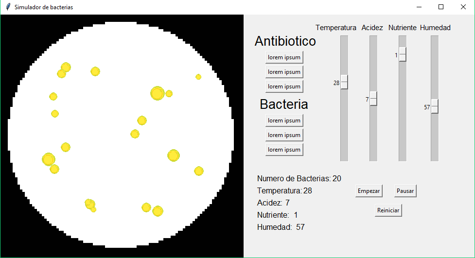

# Simulacion-de-bacterias

## Simulador de una poblacion de bacterias

Este simulador de bacterias sirve como una manera de representar una poblacion de bacterias, podiendo modificar las condiciones ambientales

